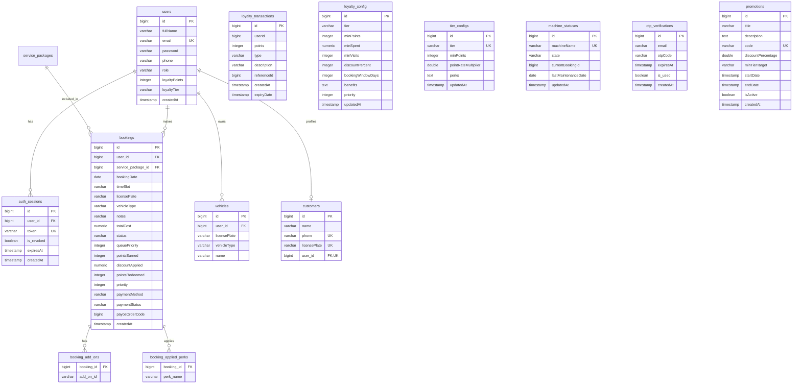

# 🚗 Tài Liệu Thiết Kế Cơ Sở Dữ Liệu - AutoClean

Tài liệu này mô tả chi tiết cấu trúc cơ sở dữ liệu PostgreSQL của hệ thống quản lý dịch vụ rửa xe thông minh **AutoClean**. Cơ sở dữ liệu này được cấu hình tự động thông qua Spring Data JPA và Hibernate trong mã nguồn backend (`backend/src/main/resources/application.yml`).

---

## 📊 Sơ Đồ Quan Hệ Thực Thể (ER Diagram)

Dưới đây là sơ đồ quan hệ giữa các bảng trong hệ thống:

---

## 🗂️ Chi Tiết Các Bảng Dữ Liệu

Hệ thống có tổng cộng **12 bảng thực thể chính** và **2 bảng phụ** phục vụ cho các kiểu dữ liệu danh sách (`@ElementCollection`).

### 1. Bảng `users`
Bảng này lưu trữ thông tin tài khoản người dùng của hệ thống, bao gồm cả khách hàng và quản trị viên (Admin).

*   **Tên Class Entity:** `User`
*   **Ràng buộc Unique:** `email`

| Tên Cột | Kiểu Dữ Liệu (DB) | Thuộc Tính Entity | Ràng Buộc | Mô Tả |
| :--- | :--- | :--- | :--- | :--- |
| `id` | `BIGINT` | `Long id` | Primary Key, Auto Increment | ID tự tăng của tài khoản. |
| `full_name` | `VARCHAR(100)` | `String fullName` | `NOT NULL`, length: 2 - 100 | Họ và tên đầy đủ của người dùng. |
| `email` | `VARCHAR(150)` | `String email` | `NOT NULL`, `UNIQUE` | Địa chỉ email dùng để đăng nhập. |
| `password` | `VARCHAR(255)` | `String password` | `NOT NULL` | Mật khẩu tài khoản (đã được mã hóa BCrypt). |
| `phone` | `VARCHAR(20)` | `String phone` | `NULL` | Số điện thoại liên hệ. |
| `role` | `VARCHAR(20)` | `Role role` | `NOT NULL` | Vai trò của người dùng (Xem danh sách Enum `Role`). Mặc định: `ROLE_CUSTOMER`. |
| `loyalty_points` | `INTEGER` | `Integer loyaltyPoints` | `NOT NULL`, Mặc định: `0` | Số điểm tích lũy hiện tại của người dùng. |
| `loyalty_tier` | `VARCHAR(10)` | `LoyaltyTier loyaltyTier` | `NOT NULL`, Mặc định: `BRONZE` | Hạng thành viên hiện tại (Xem danh sách Enum `LoyaltyTier`). |
| `created_at` | `TIMESTAMP` | `LocalDateTime createdAt`| `NOT NULL`, Auto-generated | Thời điểm tạo tài khoản. |

---

### 2. Bảng `customers`
Bảng này dùng để lưu trữ thông tin hồ sơ chi tiết của khách hàng rửa xe, hỗ trợ liên kết trực tiếp với tài khoản người dùng (`users`).

*   **Tên Class Entity:** `Customer`
*   **Ràng buộc Unique:** `phone`, `license_plate`, `user_id`

| Tên Cột | Kiểu Dữ Liệu (DB) | Thuộc Tính Entity | Ràng Buộc | Mô Tả |
| :--- | :--- | :--- | :--- | :--- |
| `id` | `BIGINT` | `Long id` | Primary Key, Auto Increment | ID tự tăng của khách hàng. |
| `name` | `VARCHAR(100)` | `String name` | `NOT NULL` | Tên của khách hàng. |
| `phone` | `VARCHAR(20)` | `String phone` | `UNIQUE` | Số điện thoại của khách hàng. |
| `license_plate` | `VARCHAR(20)` | `String licensePlate` | `UNIQUE` | Biển số xe mặc định/chính của khách hàng. |
| `user_id` | `BIGINT` | `User user` | Foreign Key (`users.id`), `UNIQUE` | Liên kết 1-1 với tài khoản người dùng. |

---

### 3. Bảng `auth_sessions`
Lưu trữ thông tin các phiên đăng nhập và Token JWT của người dùng để hỗ trợ cơ chế đăng xuất hoặc thu hồi token (Revocation).

*   **Tên Class Entity:** `AuthSession`
*   **Ràng buộc Unique:** `token`

| Tên Cột | Kiểu Dữ Liệu (DB) | Thuộc Tính Entity | Ràng Buộc | Mô Tả |
| :--- | :--- | :--- | :--- | :--- |
| `id` | `BIGINT` | `Long id` | Primary Key, Auto Increment | ID tự tăng của phiên làm việc. |
| `user_id` | `BIGINT` | `User user` | Foreign Key (`users.id`), `NOT NULL` | ID của tài khoản sở hữu phiên này. |
| `token` | `VARCHAR(500)` | `String token` | `NOT NULL`, `UNIQUE` | Nội dung JWT token. |
| `is_revoked` | `BOOLEAN` | `boolean revoked` | `NOT NULL`, Mặc định: `false` | Đánh dấu token đã bị thu hồi/vô hiệu hóa hay chưa. |
| `expires_at` | `TIMESTAMP` | `LocalDateTime expiresAt`| `NOT NULL` | Thời gian hết hạn của token. |
| `created_at` | `TIMESTAMP` | `LocalDateTime createdAt`| `NOT NULL`, Auto-generated | Thời điểm phiên đăng nhập được khởi tạo. |

---

### 4. Bảng `vehicles`
Lưu danh sách xe thuộc sở hữu của khách hàng. Một khách hàng có thể sở hữu nhiều xe khác nhau.

*   **Tên Class Entity:** `Vehicle`
*   **Ràng buộc Unique:** Cặp giá trị song hành `(license_plate, user_id)` (Tránh một user tạo trùng biển số xe).

| Tên Cột | Kiểu Dữ Liệu (DB) | Thuộc Tính Entity | Ràng Buộc | Mô Tả |
| :--- | :--- | :--- | :--- | :--- |
| `id` | `BIGINT` | `Long id` | Primary Key, Auto Increment | ID tự tăng của phương tiện. |
| `user_id` | `BIGINT` | `User user` | Foreign Key (`users.id`), `NOT NULL` | ID chủ sở hữu chiếc xe này. |
| `license_plate` | `VARCHAR(20)` | `String licensePlate` | `NOT NULL` | Biển số xe của phương tiện. |
| `vehicle_type` | `VARCHAR(20)` | `VehicleType vehicleType`| `NOT NULL`, Mặc định: `XE_MAY` | Loại xe (Xem danh sách Enum `VehicleType`). |
| `name` | `VARCHAR(50)` | `String name` | `NULL` | Tên gợi nhớ/Biệt danh của xe (Ví dụ: "Xe đi làm", "Wave Alpha"). |

---

### 5. Bảng `service_packages`
Bảng lưu thông tin các gói dịch vụ rửa xe có sẵn trong cửa hàng (ví dụ: Rửa cơ bản, Rửa chi tiết, Phủ nano...).

*   **Tên Class Entity:** `ServicePackage`
*   **Ràng buộc Unique:** `name`

| Tên Cột | Kiểu Dữ Liệu (DB) | Thuộc Tính Entity | Ràng Buộc | Mô Tả |
| :--- | :--- | :--- | :--- | :--- |
| `id` | `BIGINT` | `Long id` | Primary Key, Auto Increment | ID tự tăng của gói dịch vụ. |
| `name` | `VARCHAR(50)` | `String name` | `NOT NULL`, `UNIQUE` | Tên của gói dịch vụ. |
| `description` | `VARCHAR(500)` | `String description` | `NULL` | Mô tả chi tiết về các bước/lợi ích của dịch vụ. |
| `price` | `NUMERIC(10, 2)` | `BigDecimal price` | `NOT NULL` | Giá niêm yết của gói dịch vụ (phải > 0). |
| `duration_minutes` | `INTEGER` | `Integer durationMinutes`| `NOT NULL` | Thời gian thực hiện dự kiến (phút). |
| `points_earned` | `INTEGER` | `Integer pointsEarned` | `NOT NULL` | Số điểm tích lũy được sau khi hoàn thành dịch vụ này. |
| `active` | `BOOLEAN` | `Boolean active` | `NOT NULL`, Mặc định: `true` | Trạng thái dịch vụ có đang được cung cấp hay không. |

---

### 6. Bảng `bookings`
Bảng trung tâm lưu trữ thông tin đặt lịch hẹn rửa xe của khách hàng.

*   **Tên Class Entity:** `Booking`
*   **Chỉ mục (Indexes):**
    *   `idx_booking_date` trên cột `booking_date` (tăng tốc độ tra cứu lịch theo ngày).
    *   `idx_booking_status` trên cột `status` (lọc nhanh theo trạng thái đơn đặt).
    *   `idx_booking_user` trên cột `user_id` (truy xuất nhanh lịch sử của từng khách hàng).

| Tên Cột | Kiểu Dữ Liệu (DB) | Thuộc Tính Entity | Ràng Buộc | Mô Tả |
| :--- | :--- | :--- | :--- | :--- |
| `id` | `BIGINT` | `Long id` | Primary Key, Auto Increment | ID tự tăng của đơn đặt lịch. |
| `user_id` | `BIGINT` | `User user` | Foreign Key (`users.id`), `NOT NULL` | ID khách hàng thực hiện đặt lịch. |
| `service_package_id`| `BIGINT` | `ServicePackage servicePackage`| Foreign Key (`service_packages.id`), `NOT NULL` | Gói dịch vụ chính được chọn. |
| `booking_date` | `DATE` | `LocalDate bookingDate` | `NOT NULL` | Ngày đặt hẹn rửa xe. |
| `time_slot` | `VARCHAR(20)` | `String timeSlot` | `NOT NULL` | Khung giờ hẹn (ví dụ: `08:00-09:00`). |
| `license_plate` | `VARCHAR(20)` | `String licensePlate` | `NULL` | Biển số xe mang đi rửa. |
| `vehicle_type` | `VARCHAR(20)` | `VehicleType vehicleType`| `NULL` | Loại xe thực tế (Xem Enum `VehicleType`). |
| `notes` | `VARCHAR(1000)`| `String notes` | `NULL` | Ghi chú thêm từ khách hàng. |
| `total_cost` | `NUMERIC(12, 2)`| `BigDecimal totalCost` | `NULL` | Tổng chi phí cuối cùng của lịch đặt (sau giảm giá). |
| `status` | `VARCHAR(20)` | `BookingStatus status` | `NOT NULL`, Mặc định: `PENDING` | Trạng thái của đơn (Xem Enum `BookingStatus`). |
| `queue_priority` | `INTEGER` | `Integer queuePriority`| `NOT NULL`, Mặc định: `0` | Điểm ưu tiên xếp hàng (giá trị càng lớn càng được ưu tiên). |
| `points_earned` | `INTEGER` | `Integer pointsEarned` | `NOT NULL`, Mặc định: `0` | Số điểm thực tế tích lũy được từ đơn này. |
| `discount_applied` | `NUMERIC(10, 2)`| `BigDecimal discountApplied`| `NOT NULL`, Mặc định: `0` | Số tiền giảm giá được áp dụng (VNĐ). |
| `points_redeemed` | `INTEGER` | `Integer pointsRedeemed`| `NOT NULL`, Mặc định: `0` | Số điểm tích lũy được tiêu thụ để quy đổi ưu đãi. |
| `priority` | `INTEGER` | `Integer priority` | `NOT NULL`, Mặc định: `1` | Mức độ ưu tiên của khách (1: NORMAL, 2: MEDIUM, 3: HIGH, 4: PLATINUM). |
| `payment_method` | `VARCHAR(20)` | `PaymentMethod paymentMethod`| `NULL` | Phương thức thanh toán (Xem Enum `PaymentMethod`). |
| `payment_status` | `VARCHAR(20)` | `PaymentStatus paymentStatus`| Mặc định: `UNPAID` | Trạng thái thanh toán (Xem Enum `PaymentStatus`). |
| `payos_order_code` | `BIGINT` | `Long payosOrderCode` | `NULL` | Mã đơn hàng trên hệ thống cổng thanh toán PayOS. |
| `created_at` | `TIMESTAMP` | `LocalDateTime createdAt`| `NOT NULL`, Auto-generated | Thời điểm khởi tạo lịch hẹn. |

#### 6.1. Bảng phụ `booking_add_ons`
Bảng phụ lưu trữ danh sách mã ID của các gói dịch vụ phụ trội (Add-ons) đi kèm với lịch đặt xe (Thiết kế dạng `@ElementCollection`).

*   **Tên Bảng (DB):** `booking_add_ons`
*   **Khóa ngoại:** `booking_id` tham chiếu tới `bookings.id`.

| Tên Cột | Kiểu Dữ Liệu (DB) | Thuộc Tính Entity | Mô Tả |
| :--- | :--- | :--- | :--- |
| `booking_id` | `BIGINT` | `@JoinColumn` | ID đơn đặt lịch sở hữu add-ons này. |
| `add_on_id` | `VARCHAR` | `List<String> addOnIds` | ID dịch vụ phụ trợ (ví dụ: hút bụi, xịt gầm...). |

#### 6.2. Bảng phụ `booking_applied_perks`
Bảng phụ lưu trữ danh sách các đặc quyền/quyền lợi đã áp dụng cho đơn đặt này (ví dụ: nước uống miễn phí, ưu tiên làm trước...) dựa vào phân hạng thành viên.

*   **Tên Bảng (DB):** `booking_applied_perks`
*   **Khóa ngoại:** `booking_id` tham chiếu tới `bookings.id`.

| Tên Cột | Kiểu Dữ Liệu (DB) | Thuộc Tính Entity | Mô Tả |
| :--- | :--- | :--- | :--- |
| `booking_id` | `BIGINT` | `@JoinColumn` | ID đơn đặt lịch. |
| `perk_name` | `VARCHAR` | `List<String> appliedPerks` | Tên đặc quyền (ví dụ: "Free Drink", "Priority Lane"). |

---

### 7. Bảng `loyalty_config`
Lưu trữ thông tin cấu hình điều kiện và quyền lợi của từng hạng thành viên (Dùng cho cấu trúc kiểm soát tính năng động).

*   **Tên Class Entity:** `LoyaltyConfig`

| Tên Cột | Kiểu Dữ Liệu (DB) | Thuộc Tính Entity | Ràng Buộc | Mô Tả |
| :--- | :--- | :--- | :--- | :--- |
| `id` | `BIGINT` | `Long id` | Primary Key, Auto Increment | ID của cấu hình. |
| `tier` | `VARCHAR(20)` | `String tier` | `NOT NULL` | Hạng thành viên (BRONZE, SILVER, GOLD, PLATINUM). |
| `min_points` | `INTEGER` | `Integer minPoints` | `NULL` | Số điểm tối thiểu để đạt hạng này. |
| `min_spent` | `NUMERIC(12, 2)`| `BigDecimal minSpent` | `NULL` | Số tiền chi tiêu tối thiểu tích lũy để đạt hạng. |
| `min_visits` | `INTEGER` | `Integer minVisits` | `NULL` | Số lần ghé tiệm tối thiểu để đạt hạng. |
| `discount_percent` | `INTEGER` | `Integer discountPercent`| `NULL` | % giảm giá tự động cho hạng này. |
| `booking_window_days`| `INTEGER` | `Integer bookingWindowDays`| `NULL` | Số ngày được đặt lịch trước tối đa của hạng này. |
| `benefits` | `TEXT` | `String benefits` | `NULL` | Mô tả các quyền lợi bổ sung (có thể lưu text hoặc JSON). |
| `priority` | `INTEGER` | `Integer priority` | `NULL` | Độ ưu tiên xếp hàng mặc định cho hạng (1-4). |
| `updated_at` | `TIMESTAMP` | `LocalDateTime updatedAt`| `NULL`, Auto-updated | Thời điểm cập nhật cấu hình lần cuối. |

---

### 8. Bảng `tier_configs`
Bảng cấu hình hạng thành viên đồng bộ với Enum `LoyaltyTier`.

*   **Tên Class Entity:** `TierConfig`
*   **Ràng buộc Unique:** `tier`

| Tên Cột | Kiểu Dữ Liệu (DB) | Thuộc Tính Entity | Ràng Buộc | Mô Tả |
| :--- | :--- | :--- | :--- | :--- |
| `id` | `BIGINT` | `Long id` | Primary Key, Auto Increment | ID cấu hình. |
| `tier` | `VARCHAR(20)` | `LoyaltyTier tier` | `NOT NULL`, `UNIQUE` | Phân hạng thành viên (Xem Enum `LoyaltyTier`). |
| `min_points` | `INTEGER` | `Integer minPoints` | `NOT NULL` | Điểm tối thiểu để thăng lên hạng này. |
| `point_rate_multiplier`| `DOUBLE PRECISION`| `Double pointRateMultiplier`| Mặc định: `1.0` | Hệ số nhân điểm thưởng khi rửa xe (ví dụ: Gold được x1.2 điểm). |
| `perks` | `TEXT` | `String perks` | `NULL` | Mô tả các đặc quyền dưới dạng văn bản. |
| `updated_at` | `TIMESTAMP` | `LocalDateTime updatedAt`| `NULL`, Auto-updated | Thời điểm cập nhật cuối cùng. |

---

### 9. Bảng `loyalty_transactions`
Lưu trữ lịch sử chi tiết tất cả các giao dịch tăng/giảm điểm tích lũy của khách hàng để phục vụ cho việc đối soát và kiểm tra.

*   **Tên Class Entity:** `LoyaltyTransaction`

| Tên Cột | Kiểu Dữ Liệu (DB) | Thuộc Tính Entity | Ràng Buộc | Mô Tả |
| :--- | :--- | :--- | :--- | :--- |
| `id` | `BIGINT` | `Long id` | Primary Key, Auto Increment | ID giao dịch điểm. |
| `user_id` | `BIGINT` | `Long userId` | `NOT NULL` | ID người dùng được điều chỉnh điểm. |
| `points` | `INTEGER` | `Integer points` | `NOT NULL` | Số điểm thay đổi (Có thể dương khi nhận, âm khi tiêu dùng). |
| `type` | `VARCHAR(20)` | `String type` | `NOT NULL` | Loại giao dịch: `EARNED` (Nhận điểm), `REDEEMED` (Tiêu điểm), `EXPIRED` (Hết hạn). |
| `description` | `VARCHAR(255)` | `String description` | `NULL` | Diễn giải lý do thay đổi (ví dụ: "Đặt lịch hẹn #12"). |
| `reference_id` | `BIGINT` | `Long referenceId` | `NULL` | Mã đơn `Booking` hoặc thực thể liên quan gây ra giao dịch này. |
| `created_at` | `TIMESTAMP` | `LocalDateTime createdAt`| `NULL` | Thời điểm giao dịch phát sinh. |
| `expiry_date` | `TIMESTAMP` | `LocalDateTime expiryDate`| `NULL` | Hạn sử dụng của điểm (nếu có chính sách hết hạn điểm). |

---

### 10. Bảng `machine_statuses`
Dùng để giám sát trạng thái hoạt động theo thời gian thực (Real-time monitoring) của các máy rửa hoặc các khoang rửa trong cửa hàng.

*   **Tên Class Entity:** `MachineStatus`
*   **Ràng buộc Unique:** `machine_name`

| Tên Cột | Kiểu Dữ Liệu (DB) | Thuộc Tính Entity | Ràng Buộc | Mô Tả |
| :--- | :--- | :--- | :--- | :--- |
| `id` | `BIGINT` | `Long id` | Primary Key, Auto Increment | ID khoang/máy rửa xe. |
| `machine_name` | `VARCHAR(50)` | `String machineName` | `NOT NULL`, `UNIQUE` | Tên máy hoặc tên khoang rửa (ví dụ: "Bay 1", "Bay 2"). |
| `state` | `VARCHAR(20)` | `MachineState state` | `NOT NULL`, Mặc định: `AVAILABLE` | Trạng thái hiện tại (Xem Enum `MachineState`). |
| `current_booking_id`| `BIGINT` | `Long currentBookingId` | `NULL` | ID của đơn đặt (`Booking`) hiện đang được xử lý tại đây. |
| `last_maintenance_date`| `DATE` | `LocalDate lastMaintenanceDate`| `NULL` | Ngày bảo trì máy định kỳ gần nhất. |
| `updated_at` | `TIMESTAMP` | `LocalDateTime updatedAt`| `NOT NULL`, Auto-updated | Thời điểm cập nhật trạng thái mới nhất. |

---

### 11. Bảng `otp_verifications`
Lưu trữ thông tin các mã OTP được gửi qua email phục vụ cho việc xác minh tài khoản hoặc đặt lại mật khẩu.

*   **Tên Class Entity:** `OTPVerification`
*   **Chỉ mục (Indexes):** `idx_otp_email` trên cột `email` (tối ưu truy vấn tìm OTP của một email).

| Tên Cột | Kiểu Dữ Liệu (DB) | Thuộc Tính Entity | Ràng Buộc | Mô Tả |
| :--- | :--- | :--- | :--- | :--- |
| `id` | `BIGINT` | `Long id` | Primary Key, Auto Increment | ID bản ghi. |
| `email` | `VARCHAR` | `String email` | `NOT NULL` | Email nhận mã xác minh. |
| `otp_code` | `VARCHAR(10)` | `String otpCode` | `NOT NULL` | Mã OTP gồm các chữ số. |
| `expires_at` | `TIMESTAMP` | `LocalDateTime expiresAt`| `NOT NULL` | Thời gian hết hiệu lực của mã OTP này. |
| `is_used` | `BOOLEAN` | `boolean used` | `NOT NULL`, Mặc định: `false` | Đánh dấu xem OTP này đã được xác thực thành công chưa. |
| `created_at` | `TIMESTAMP` | `LocalDateTime createdAt`| `NOT NULL`, Auto-generated | Thời điểm sinh mã OTP. |

---

### 12. Bảng `promotions`
Lưu trữ các chiến dịch khuyến mãi và mã giảm giá (Voucher) áp dụng khi đặt lịch rửa xe.

*   **Tên Class Entity:** `Promotion`
*   **Ràng buộc Unique:** `code`

| Tên Cột | Kiểu Dữ Liệu (DB) | Thuộc Tính Entity | Ràng Buộc | Mô Tả |
| :--- | :--- | :--- | :--- | :--- |
| `id` | `BIGINT` | `Long id` | Primary Key, Auto Increment | ID chiến dịch khuyến mãi. |
| `title` | `VARCHAR(150)` | `String title` | `NOT NULL` | Tiêu đề của chương trình khuyến mãi. |
| `description` | `TEXT` | `String description` | `NULL` | Mô tả chi tiết/điều kiện áp dụng chương trình. |
| `code` | `VARCHAR(50)` | `String code` | `NOT NULL`, `UNIQUE` | Mã giảm giá dùng để nhập khi thanh toán (ví dụ: `SUMMER50`). |
| `discount_percentage`| `DOUBLE PRECISION`| `Double discountPercentage`| `NOT NULL` | Tỷ lệ giảm giá (ví dụ: `10.0` nghĩa là giảm 10%). |
| `min_tier_target` | `VARCHAR(20)` | `LoyaltyTier minTierTarget`| `NOT NULL` | Hạng thành viên tối thiểu cần đạt để được áp dụng mã này. |
| `start_date` | `TIMESTAMP` | `LocalDateTime startDate`| `NOT NULL` | Ngày & Giờ bắt đầu áp dụng chương trình khuyến mãi. |
| `end_date` | `TIMESTAMP` | `LocalDateTime endDate` | `NOT NULL` | Ngày & Giờ chương trình khuyến mãi kết thúc. |
| `is_active` | `BOOLEAN` | `Boolean isActive` | `NOT NULL`, Mặc định: `true` | Đang kích hoạt hay đã tạm ngắt chương trình. |
| `created_at` | `TIMESTAMP` | `LocalDateTime createdAt`| `NOT NULL`, Auto-generated | Thời điểm tạo chiến dịch. |

---

## ⚙️ Danh Sách Các Kiểu Liệu Enum (Enumeration)

Các trường kiểu String giới hạn miền giá trị được định nghĩa trong hệ thống thông qua các Java Enum. Khi đồng bộ xuống DB, Hibernate chuyển đổi các trường này thành kiểu `VARCHAR` và lưu dạng text hoa.

### 1. `Role`
Phân quyền tài khoản người dùng:
*   `ROLE_CUSTOMER`: Khách hàng sử dụng dịch vụ.
*   `ROLE_ADMIN`: Quản trị viên quản lý toàn bộ hệ thống, xem báo cáo, doanh thu và cấu hình máy.

### 2. `BookingStatus`
Trạng thái xử lý của một đơn đặt lịch rửa xe:
*   `PENDING`: Mới tạo lịch hẹn, chờ hệ thống/Admin xác nhận hoặc chờ thanh toán trực tuyến.
*   `CONFIRMED`: Đã xác nhận lịch rửa xe thành công.
*   `COMPLETED`: Xe đã được rửa xong và bàn giao cho khách.
*   `CANCELLED`: Lịch hẹn đã bị hủy (do khách hàng chủ động hoặc hệ thống từ chối).

### 3. `LoyaltyTier`
Phân hạng mức độ thành viên tích lũy điểm:
*   `BRONZE` (Đồng): Tích lũy từ `0` - `499` điểm.
*   `SILVER` (Bạc): Tích lũy từ `500` - `1499` điểm.
*   `GOLD` (Vàng): Tích lũy từ `1500` - `2999` điểm.
*   `PLATINUM` (Bạch Kim): Tích lũy từ `3000` điểm trở lên.

### 4. `VehicleType`
Phân loại phương tiện mang tới rửa (để tính giá dịch vụ hoặc sắp xếp khoang rửa phù hợp):
*   `XE_MAY`: Các loại xe máy, xe mô tô hai bánh.
*   `SEDAN`: Dòng xe ô tô 4 chỗ gầm thấp.
*   `SUV`: Dòng xe thể thao đa dụng gầm cao 5 - 7 chỗ.
*   `PICKUP`: Xe ô tô bán tải.

### 5. `MachineState`
Trạng thái hoạt động của khoang rửa xe (bảo trì hoặc bận rửa):
*   `AVAILABLE`: Rảnh rỗi, sẵn sàng tiếp nhận xe vào rửa.
*   `IN_USE`: Đang có xe rửa bên trong khoang.
*   `MAINTENANCE`: Đang gặp sự cố hoặc bảo trì định kỳ, không tiếp nhận xe.

### 6. `PaymentMethod`
Phương thức thanh toán dịch vụ của khách hàng:
*   `CASH`: Thanh toán trực tiếp bằng tiền mặt sau khi rửa xong.
*   `TRANSFER`: Chuyển khoản ngân hàng (qua PayOS/SePay).

### 7. `PaymentStatus`
Trạng thái thanh toán của đơn đặt lịch:
*   `UNPAID`: Chưa thực hiện thanh toán chi phí.
*   `PAID`: Đã nhận đủ tiền thanh toán.
*   `CANCELLED`: Giao dịch thanh toán bị hủy bỏ hoặc hoàn tiền.
